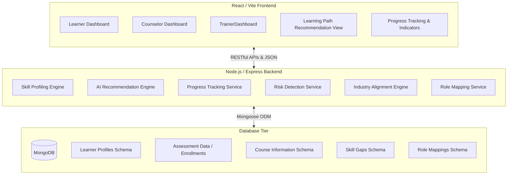

# System Architecture Overview

This document provides a comprehensive overview of the **SkillUp** application architecture, detailing how the Frontend, Backend, and Database tiers coordinate to deliver a modern, AI-powered learning path and skill gap analysis experience.

---

## Architecture Diagram

---

## 1. Frontend (Presentation Tier)

Built using **React** and bundled with **Vite** for optimized build performance. It provides interactive, highly-responsive client-side routing using `react-router` and a premium modern user experience.

### Key Dashboards & Views
*   **Learner Dashboard (`LearnerDashboard.jsx`)**:
    *   Dynamic overview of current progress, career readiness scores, recommended roles, and early warnings.
    *   Integrates visual progress bars and custom dashboard cards.
*   **Counselor Dashboard (`CounselorDashboard.jsx`)**:
    *   Multi-learner monitoring interface with group readiness scores, analytics, and risk indicators.
    *   Facilitates direct action recommendation feeds and alerts management.
*   **Trainer Dashboard (`TrainerDashboard.jsx`)**:
    *   Curriculum performance statistics, course completion rates, and insights on struggling learners.
*   **Recommendation Screens (`LearningPath.jsx` & `Login.jsx`)**:
    *   Interactive goal selector (e.g., target role choosing), custom AI roadmap timelines, and video lecture lists.
*   **Progress Indicators (`ProgressTracking.jsx` & `ProgressBar.jsx`)**:
    *   Data visualizations utilizing `recharts` for progress tracking, visual feedback loops, and career readiness scores.

---

## 2. Backend (Application Tier)

Powered by **Node.js** and **Express.js**, exposing RESTful API endpoints. It implements server-side controllers that run the business logic engines:

### Core Backend Engines
*   **Skill Profiling & Role Mapping (`routes/roles.js`)**:
    *   Analyzes learner's current known skills against industry benchmarks.
    *   Computes role match percentages and generates personalized skill gaps.
*   **AI Recommendation Engine (`routes/path-generator.js` & `routes/videos.js`)**:
    *   Generates multi-stage learning roadmaps.
    *   Retrieves matching courses, Youtube educational videos (via YouTube search integration), and materials.
*   **Progress Tracking & Risk Detection (`routes/activity.js` & `routes/learner.js`)**:
    *   Keeps track of course completions, learning streaks, activity timelines, and early warning risk alert levels.
*   **Notification Engine (`routes/notifications.js`)**:
    *   Triggers real-time alerts for learners and counselors upon changes in course status, assignments, or risk elevations.

---

## 3. Database (Data Tier)

Built on **MongoDB** (using **Mongoose ODM**) to provide high schema flexibility, horizontal scalability, and rapid queries for structured/semi-structured learning records.

### Document Schemas & Collections
*   **Learner Profiles (`models/User.js`)**:
    *   Maintains name, email, credentials (hashed via bcryptjs), role configuration, career goals, phone, location, and user preferences (theme context, notification toggles).
*   **Course Information (`models/Course.js`)**:
    *   Contains curriculum schemas, difficulty tiers, skill alignment tags, and materials metadata.
*   **Learning Paths (`models/LearningPath.js`)**:
    *   A multi-stage timeline representation mapping users to a list of target roles, stages, and array of references to specific `Course` documents.
*   **Enrollment & Assessments (`models/Enrollment.js`)**:
    *   Maps learners to specific courses, tracking completion status, scores, milestones, and active progress.
*   **Activity Logs (`models/Activity.js`)**:
    *   Chronological records of events used to generate progress charts, compute streak metrics, and flag early alerts.
*   **Database Engine Selection**:
    *   *Options*: MySQL vs MongoDB
    *   *Selected*: **MongoDB** (for JSON-native nested stage timeline structures, dynamic skill sets, and highly-performant document lookup capabilities).

---

## 4. API Endpoints Reference

The backend exposes a RESTful JSON API. Requests from the React frontend are handled using the custom `useFetch` hook or `apiCall` helper in [useFetch.js](file:///d:/SkillUp%20UI%20Design%20(1)/src/app/hooks/useFetch.js), which auto-attaches JWT auth headers and prefixes the backend server port (port `5000` locally).

All API routes are mounted in [server/index.js](file:///d:/SkillUp%20UI%20Design%20(1)/server/index.js) and are structured as follows:

### A. Authentication APIs
*   **Source File**: [routes/auth.js](file:///d:/SkillUp%20UI%20Design%20(1)/server/routes/auth.js)
*   **Base URL**: `/api/auth`
*   **Endpoints**:
    *   `POST /register` – Creates new user accounts with default role `'learner'`.
    *   `POST /login` – Validates credentials and returns JWT bearer token.
    *   `POST /google` – Handles Google OAuth 2.0 social logins and profile syncs.

### B. Learner Dashboard & Progress APIs
*   **Source File**: [routes/learner.js](file:///d:/SkillUp%20UI%20Design%20(1)/server/routes/learner.js)
*   **Base URL**: `/api/learner`
*   **Endpoints**:
    *   `GET /dashboard` – Aggregates learning metrics, active streak days, month-by-month progress, and skill radar chart data.
    *   `GET /path` – Retrieves the user's multi-stage learning path and courses.
    *   `PUT /progress/:courseId` – Updates user progress percentage and enrollment status.
    *   `PUT /complete/:courseId` – Marks a course as 100% completed.
    *   `DELETE /progress/reset` – Wipes all enrollment records for the active learner.
    *   `GET /progress-stats` – Gets high-granularity progress metrics and detailed learner activity logs.

### C. Customized Path Generator APIs
*   **Source File**: [routes/path-generator.js](file:///d:/SkillUp%20UI%20Design%20(1)/server/routes/path-generator.js)
*   **Base URL**: `/api/learner`
*   **Endpoints**:
    *   `POST /generate-path` – Scores available courses based on user goals, level, and known skills, then groups selected courses into Foundation, Core, and Advanced stages.

### D. Video Learning Content APIs
*   **Source File**: [routes/videos.js](file:///d:/SkillUp%20UI%20Design%20(1)/server/routes/videos.js)
*   **Base URL**: `/api/learner`
*   **Endpoints**:
    *   `GET /videos/:courseId` – Fetches and caches high-quality YouTube educational videos matching the course topic.
    *   `PUT /videos/complete` – Toggles individual video completion state and adjusts course progress percentage.

### E. Activity Tracking & Streak APIs
*   **Source File**: [routes/activity.js](file:///d:/SkillUp%20UI%20Design%20(1)/server/routes/activity.js)
*   **Base URL**: `/api/activity`
*   **Endpoints**:
    *   `POST /log` – Registerstimezone-safe daily learning activities.
    *   `GET /streak` – Retrieves active dates from the last 30 days to compute active streaks.

### F. Alerts & Notification APIs
*   **Source File**: [routes/notifications.js](file:///d:/SkillUp%20UI%20Design%20(1)/server/routes/notifications.js)
*   **Base URL**: `/api/notifications`
*   **Endpoints**:
    *   `GET /` – Lists the last 50 notifications for the logged-in user.
    *   `GET /unread-count` – Retrieves the unread notification count.
    *   `PUT /:id/read` – Marks a specific alert as read.
    *   `PUT /read-all` – Marks all user alerts as read.
    *   `POST /send` – Enables Trainers/Counselors to send custom alerts to learner accounts.
    *   `POST /reminder` – Allows self-scheduled learning reminders.

### G. User Account & Settings APIs
*   **Source File**: [routes/settings.js](file:///d:/SkillUp%20UI%20Design%20(1)/server/routes/settings.js)
*   **Base URL**: `/api/user`
*   **Endpoints**:
    *   `GET /profile` – Fetches core user details and app preferences.
    *   `PUT /profile` – Updates user profile fields and UI preferences.
    *   `PUT /password` – Validates old password and hashes/updates with a new password.

### H. Role-Specific (Trainer & Counselor) Management APIs
*   **Source File**: [routes/roles.js](file:///d:/SkillUp%20UI%20Design%20(1)/server/routes/roles.js)
*   **Base URL**: `/api` (restricted by `requireRole` middleware guard)
*   **Endpoints**:
    *   `GET /counselor/dashboard` – Retrieves student rosters, career readiness rates, support alert triggers, and skill gaps.
    *   `GET /counselor/learner/:id` – Fetches complete academic profiles, acquired skills, and specific stage statuses for a learner.
    *   `GET /trainer/dashboard` – Returns total enrollment counts, class performance charts, struggling learner list, and trend tracking.
    *   `GET /trainer/analytics` – Gathers high-level enrollment aggregates and domain-specific completion statistics.
    *   `GET /trainer/courses` – Compiles average student scores and course-by-course performance statistics.
    *   `GET /trainer/students` – Gathers complete rosters of students currently enrolled in the trainer's class.
    *   `GET /trainer/course-analytics/:courseId` – Provides single-course granular completion metrics.
    *   `GET /trainer/learning-path/:userId` – Permits trainers to examine stage progression on a student's learning roadmap.

