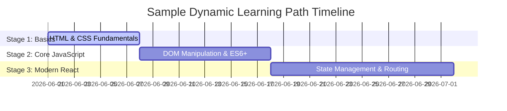

# Key Features — SkillUp Platform

The **SkillUp** platform is a premium, AI-driven dashboard system designed to empower learners, assist counselors, and guide trainers. Below are the key functional features implemented within the application.

---

## Feature Matrix at a Glance

| Feature | Learner Role | Counselor Role | Trainer Role |
| :--- | :---: | :---: | :---: |
| **Personalized Roadmaps** | ✅ *Access* | ✅ *Monitor* | — |
| **Skill Gap Visualization** | ✅ *Analyze* | ✅ *Compare* | — |
| **Automated Alerts / Risk Scoring**| ✅ *Receive* | ✅ *Mitigate* | ✅ *Track* |
| **Curriculum Insights** | — | — | ✅ *Analyze & Edit* |
| **Lecture Recommendations** | ✅ *Watch* | — | — |
| **Personalization (Theme, etc.)** | ✅ *Manage* | ✅ *Manage* | ✅ *Manage* |

---

## 1. Multi-Role Dashboard Hubs

### 🎓 Learner Dashboard
*   **Career Readiness Indicator**: Displays a premium, dynamically calculated score gauge indicating placement likelihood.
*   **Recommended Roles Feed**: Recommends high-potential career choices based on matching skillsets.
*   **Recent Activity Log**: Keeps track of daily learning streaks, milestones, and timestamps of completed stages.

### 🤝 Counselor Dashboard
*   **Class & Batch Overview**: Visualizes learning parameters across multiple student profiles in clean datatables.
*   **Student Risk Distribution**: Classifies learners into 'High Risk', 'Medium Risk', or 'On Track' clusters automatically.
*   **Instant Intervention Panels**: Allows counselors to send personalized advice or program adjust instructions with one click.

### 🏫 Trainer Dashboard
*   **Course Engagement Metrics**: High-level completion rates and average test performance charts.
*   **Struggling Student Spotter**: Lists students whose activity metrics suggest they require academic assistance.
*   **Smart Curriculum Panel**: Provides automated, system-generated recommendations on updating lectures or adding exercises.

---

## 2. Dynamic Learning Paths & Roadmap TIMELINES

*   **Dynamic Roadmaps**: Generates custom stage timelines mapped to specific career goals (e.g. *Full Stack Developer*, *Data Scientist*).
*   **Custom Stages**: Organizes curriculums into clear sequential tiers (Basics, Intermediate, Advanced) containing references to core courses.

---

## 3. High-Fidelity Skill Gap Analytics

*   **Visual Gaps**: Shows a detailed comparison bar representing matching skills against current industry/role demands.
*   **Targeted Remediation**: Flags exactly which skills are missing and recommends matching courses instantly to patch the gap.

---

## 4. Lecture Video Recommendation Engine

*   **Curated Video Feed**: Pulls highly relevant lectures and technical walk-throughs aligned specifically to active learning path courses.
*   **Contextual Matching**: Automatically matches recommended courses to video modules.

---

## 5. Early Warning Risk Alert System

*   **Proactive Flags**: Triggers immediate alerts (`High`, `Medium`, `Low`) based on student participation dips or assignment delays.
*   **Notification Dispatch**: Synchronizes push alerts directly into the platform to keep students and staff fully aligned.

---

## 6. Personalization & Settings

*   **Context Theme Toggle**: Real-time styling synchronization supporting dynamic **Light**, **Dark**, and **System default** modes.
*   **Communication Controls**: Enables or disables weekly reports, automated reminders, and real-time alert pop-ups.
