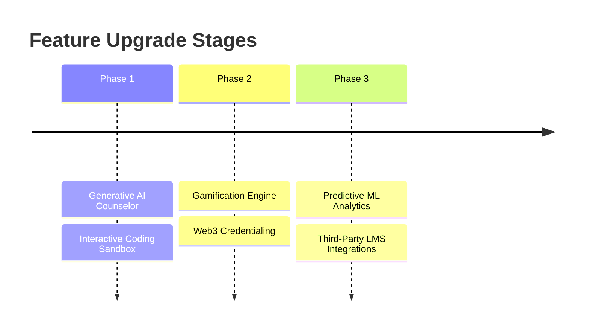

# Future Scope & Enhancement Ideas — SkillUp

To scale **SkillUp** from a premium UI dashboard into a highly intelligent, fully-integrated, enterprise-grade EdTech and career readiness ecosystem, we propose the following future enhancement roadmap.

---

## Strategic Enhancement Roadmap

---

## 1. Generative AI Career Counselor (Chat & Feedback)

*   **Real-time AI Chatbot**:
    *   Integrate LLM API interfaces (e.g., Gemini or Claude) allowing students to discuss career choices, ask technical questions, and receive personalized curriculum recommendations dynamically.
*   **AI Resume & Interview Prep**:
    *   An automated resume screening tool that grades standard PDF resumes against target job descriptions.
    *   Speech-to-text interactive AI mock interviews that analyze user answers and provide performance feedback.

---

## 2. Advanced Analytics & Machine Learning Predictive Models

*   **Student Dropout & Risk Prediction**:
    *   Implement regression and classification models trained on students' historical platform activity, streak data, and test scores to predict dropouts or course failures up to 3 weeks in advance.
*   **Predictive Path Planning**:
    *   Analyze completion trends across thousands of similar student paths to recommend the shortest, most successful sequence of courses.

---

## 3. Extensive Gamification & Web3 Credentials

*   **Dynamic Badging & Leaderboards**:
    *   Introduce visual XP (Experience Points), levels, weekly leaderboards, and modular badges to boost student competition and course engagement.
*   **Verifiable Web3 Certificates**:
    *   Integrate decentralized credential systems allowing learners to export verifiable course completion certificates directly to blockchain-backed wallets (or LinkedIn credentials).

---

## 4. Platform integrations (LMS, GitHub, LinkedIn)

*   **Automatic Portfolio Sync**:
    *   Allow users to link their GitHub and LinkedIn profiles. The platform will automatically scan repositories and work experiences to pre-populate their "Known Skills" profile.
*   **LMS Connector**:
    *   Integrate seamlessly with mainstream enterprise LMS systems (such as Canvas, Moodle, Coursera, or Udemy) to automatically fetch user course grades and lesson progression.

---

## 5. Built-in Interactive Coding Playground

*   **In-browser Sandbox**:
    *   Add an interactive code playground supporting HTML, CSS, JavaScript, and Python.
    *   Allows learners to practice coding, run tests, and check task completions within the SkillUp dashboard without installing external local editors.
