# Technical Requirements Mind Map

This document provides a highly visual, structured mind map representation of the technical requirements needed to run, host, and access the **SkillUp** web platform.

---

## Interactive Mind Map Diagram

Below is the complete architectural mind map mapping the User, Server, Environment, and Setup layers.

```mermaid
graph TD
    %% Styling Configuration
    classDef default fill:#f9fbfd,stroke:#93c5fd,stroke-width:2px,color:#1e3a8a;
    classDef root fill:#1e3a8a,stroke:#1d4ed8,stroke-width:3px,color:#ffffff,font-weight:bold;
    classDef category fill:#dbeafe,stroke:#3b82f6,stroke-width:2px,color:#1e40af,font-weight:bold;
    classDef detail fill:#eff6ff,stroke:#60a5fa,stroke-width:1px,color:#1e40af;
    classDef command fill:#ecfdf5,stroke:#10b981,stroke-width:1px,color:#065f46,font-family:monospace;

    %% Root Node
    Root(SkillUp Technical Requirements):::root

    %% Category Nodes
    Client[1. Client-Side Requirements]:::category
    Server[2. Server-Side Requirements]:::category
    Local[3. Running Locally]:::category

    %% Connect Categories
    Root --> Client
    Root --> Server
    Root --> Local

    %% Client Details
    Client --> Browsers[Modern Web Browsers]:::detail
    Browsers --> Chrome[Chrome v90+]:::detail
    Browsers --> Safari[Safari v14+]:::detail
    Browsers --> Firefox[Firefox v85+]:::detail
    Browsers --> Edge[Edge v90+]:::detail

    Client --> Devices[Device Support]:::detail
    Devices --> Mobile[Mobile / Tablet<br>iOS 14+ / Android 9.0+<br>Min 2GB RAM]:::detail
    Devices --> Desktop[Laptop / Desktop<br>Win10/11, macOS, Linux<br>Intel i3/Ryzen 3/M1<br>Min 4GB RAM]:::detail

    Client --> Display[Display & Network]:::detail
    Display --> Resolution[Fluid Responsive Layout<br>320px to 4K Ultra-HD]:::detail
    Display --> Bandwidth[Internet Connection<br>Min 1.5 Mbps Bandwidth]:::detail

    %% Server Details
    Server --> Prerequisites[Software Prerequisites]:::detail
    Prerequisites --> Node[Node.js v18.x or v20.x LTS]:::detail
    Prerequisites --> NPM[npm v9.x or later]:::detail
    Prerequisites --> DB[MongoDB v6.0+ or MongoDB Atlas]:::detail

    Server --> Ports[Required Ports]:::detail
    Ports --> P5173[Port 5173: Frontend Dev]:::detail
    Ports --> P5000[Port 5000: Backend API]:::detail

    Server --> Env[Environment Config .env]:::detail
    Env --> PortVal[PORT=5000]:::detail
    Env --> MongoURI[MONGO_URI=mongodb://...]:::detail
    Env --> Secret[JWT_SECRET=...]:::detail
    Env --> GoogleID[VITE_GOOGLE_CLIENT_ID=...]:::detail

    %% Local Run Details
    Local --> Step1[1. Start Database]:::detail
    Step1 --> S1Cmd[Start local MongoDB service]:::command

    Local --> Step2[2. Install Packages]:::detail
    Step2 --> S2Cmd[npm install]:::command

    Local --> Step3[3. Seed Database]:::detail
    Step3 --> S3Cmd[node server/seed.js]:::command

    Local --> Step4[4. Launch Application]:::detail
    Step4 --> S4Cmd[npm run dev:full]:::command
```

---

## Quick Reference Summary

### Client Specs
*   **Browsers**: Google Chrome, Safari, Firefox, Edge (2021+ releases).
*   **Hardware**: Minimum 2 GB RAM (Mobile), 4 GB RAM (Desktop).
*   **Responsiveness**: Adaptable down to **320px** wide mobile viewports.

### Server Specs
*   **Run Environment**: Node.js environment with Mongo database instance.
*   **Key Ports**: `5173` (Frontend HTTP), `5000` (Backend API).

### Commands List
| Step | Action | Command |
| :--- | :--- | :--- |
| **Install** | Install all packages | `npm install` |
| **Seed** | Populates mock platform data | `node server/seed.js` |
| **Run** | Starts client & Express concurrently | `npm run dev:full` |
