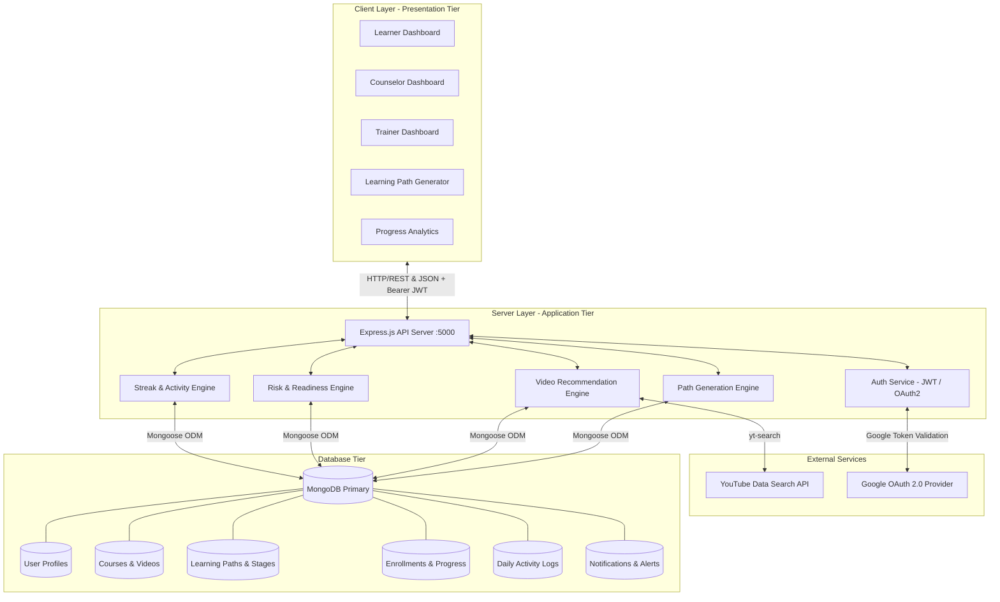
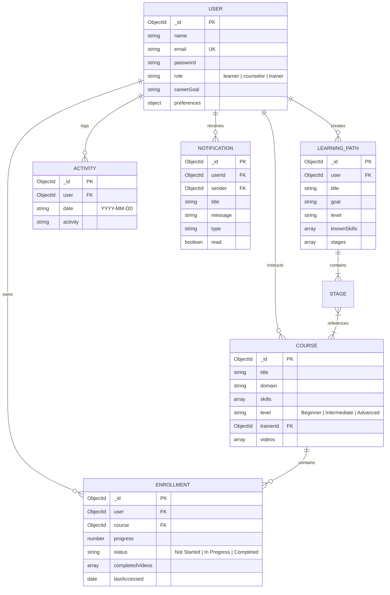
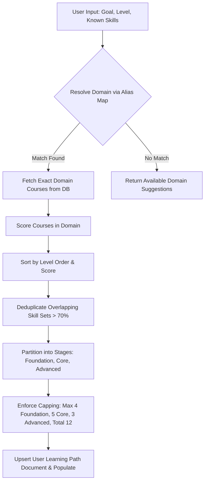
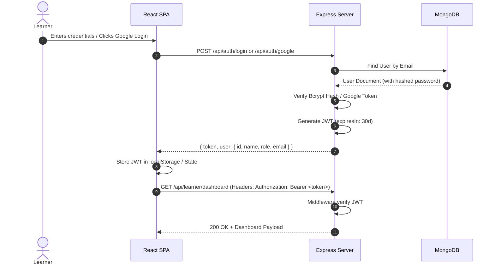
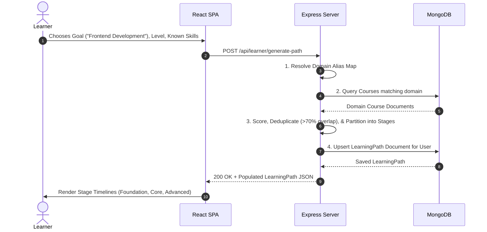
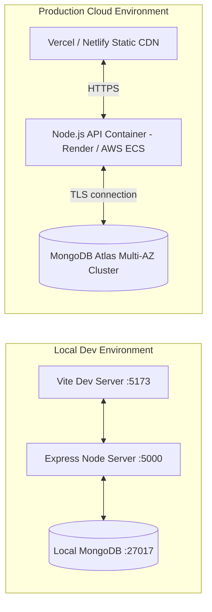

# System Design Specification — SkillUp Platform

## Executive Summary

**SkillUp** is an AI-driven adaptive learning path, skill gap analysis, and career readiness platform designed to serve three distinct personas: **Learners**, **Counselors**, and **Trainers**. 

The system leverages automated domain mapping, skill vector scoring, real-time activity/streak tracking, and role-based intervention analytics to guide users along personalized learning journeys toward high-demand tech roles.

---

## 1. System Context & Architecture Overview

---

## 2. Technology Stack & Tier Decomposition

| Tier | Technology | Key Libraries / Modules | Function |
| :--- | :--- | :--- | :--- |
| **Frontend (Presentation)** | React 18, Vite 6 | `react-router` v7, `recharts`, `lucide-react`, `tailwindcss` v4, `@react-oauth/google` | Responsive SPA, interactive charts, dynamic timeline rendering, theme switching |
| **Backend (Application)** | Node.js v18/20, Express 5 | `jsonwebtoken`, `bcryptjs`, `cors`, `dotenv`, `yt-search` | REST APIs, authentication, algorithm execution, video aggregation |
| **Database (Storage)** | MongoDB v6+ | `mongoose` ODM | Document persistence, schema validation, index-optimized spatial & aggregation queries |
| **Integrations** | External APIs | Google Auth Library, YouTube Web Scraper / API | Social OAuth authentication & video course material enrichment |

---

## 3. Database Schema & Data Models

### 3.1 Entity Relationship Diagram (ERD)

### 3.2 Collection Schemas & Data Constraints

1. **User Schema (`User.js`)**:
   - `email`: Required, unique string.
   - `role`: Enum `['learner', 'counselor', 'trainer']` (default `'learner'`).
   - `preferences`: Embedded sub-document for `theme` (`'light'|'dark'|'system'`), `notifications` (boolean), `progressReminders` (boolean), `weeklyReports` (boolean).

2. **Course Schema (`Course.js`)**:
   - `title`: Required string.
   - `domain`: Required string (e.g., `'Frontend Development'`, `'Data Science'`).
   - `skills`: Array of strings.
   - `level`: Enum `['Beginner', 'Intermediate', 'Advanced']`.
   - `videos`: Array of embedded objects `{ videoId, title, thumbnail, channel }`.

3. **LearningPath Schema (`LearningPath.js`)**:
   - `user`: Ref to `User` (required).
   - `stages`: Array of sub-documents `{ stageName: string, courses: [Ref to Course] }`.
   - `courses`: Legacy flat array of Course references for backward compatibility.

4. **Enrollment Schema (`Enrollment.js`)**:
   - `user`: Ref to `User` (required).
   - `course`: Ref to `Course` (required).
   - `progress`: Number between 0 and 100.
   - `completedVideos`: Array of video ID strings.
   - `status`: Enum `['Not Started', 'In Progress', 'Completed']`.

5. **Activity Schema (`Activity.js`)**:
   - `user`: Ref to `User` (required).
   - `date`: String formatted as `"YYYY-MM-DD"`.
   - `activity`: String description of activity.
   - **Compound Unique Index**: `{ user: 1, date: 1, activity: 1 }` to prevent duplicate daily log entries.

6. **Notification Schema (`Notification.js`)**:
   - `userId`: Ref to `User` (required recipient).
   - `sender`: Ref to `User` (optional sender for Counselor/Trainer messages).
   - `type`: Enum `['system', 'reminder', 'achievement', 'action_required', 'alert', 'trainer', 'counselor']`.

---

## 4. Algorithmic Engines Specification

### 4.1 Path Generation & Domain Resolution Engine

The Path Generator (`server/routes/path-generator.js`) uses a multi-step pipeline:

#### Scoring Formula (`scoreCourseInDomain`)
$$\text{Score} = 10 \text{ (Base)} + \Delta_{\text{title}} + \Delta_{\text{skills}} + \Delta_{\text{level}} + \Delta_{\text{gap}} - \Delta_{\text{known}}$$

Where:
- $\Delta_{\text{title}} = +3$ if any goal keyword matches course title.
- $\Delta_{\text{skills}} = +2$ if goal keyword matches course skill tags.
- $\Delta_{\text{level}} = +3$ if course level equals user chosen target level.
- $\Delta_{\text{gap}} = +2 \times \text{count of course skills user DOES NOT know}$.
- $\Delta_{\text{known}} = -3 \times \text{count of course skills user ALREADY knows}$.

#### Skill Overlapping Deduplication
If $\frac{|\text{Course Skills} \cap \text{Existing Selected Skills}|}{|\text{Course Skills}|} > 0.7$, the course is flagged as duplicate and skipped to ensure curriculum variety.

---

### 4.2 Readiness Score & Risk Detection Engine

Calculated dynamically in Counselor & Learner Controllers (`server/routes/roles.js` & `server/routes/learner.js`):

$$\text{Readiness Score} = \left\lfloor \frac{\sum_{i=1}^{N} \text{Enrollment Progress}_i}{N} \right\rfloor$$

#### Risk Classification Matrix
- **High Risk (`At Risk`)**: Readiness $< 40\%$
- **Medium Risk (`Needs Support`)**: $40\% \le \text{Readiness} \le 70\%$
- **Low Risk (`On Track`)**: Readiness $> 70\%$

#### Real Skill Gap Formula
$$\text{Missing Skills} = \bigcup_{s \in \text{Assigned Path}} \text{Skills}(s) \setminus \bigcup_{e \in \text{Completed Courses}} \text{Skills}(e)$$
$$\text{Skill Gap Count} = |\text{Missing Skills}|$$

---

## 5. API Interface Architecture

All REST API endpoints are mounted on base path `/api`.

### 5.1 Authentication Endpoints (`/api/auth`)
- `POST /register`: Registers user account (`learner`, `counselor`, or `trainer`). Returns JWT.
- `POST /login`: Validates password via `bcrypt.compare`. Returns JWT & user profile.
- `POST /google`: Validates Google OAuth credential token, syncs user profile, returns JWT.

### 5.2 Learner & Path Endpoints (`/api/learner`)
- `GET /dashboard`: Aggregates active streak, completion rates, overall progress, and skill radar chart data.
- `GET /path`: Fetches user's current populated `LearningPath`.
- `POST /generate-path`: Executes the dynamic path generator algorithm (Protected).
- `PUT /progress/:courseId`: Updates progress percentage and completed video IDs. Automatically flips status to `'Completed'` when progress $= 100\%$.
- `GET /videos/:courseId`: Fetches cached YouTube videos or queries YouTube API via `yt-search`.

### 5.3 Activity & Streak Endpoints (`/api/activity`)
- `POST /log`: Logs daily activity for timezone-safe `"YYYY-MM-DD"` date.
- `GET /streak`: Analyzes last 30 days of activity logs to compute active daily streak.

### 5.4 Staff & Role Management Endpoints (`/api`)
- `GET /counselor/dashboard`: Aggregates all learner readiness scores, risk distributions, and missing skill metrics (Requires `counselor` role).
- `GET /counselor/learner/:id`: Deep academic profile view for a specific student.
- `GET /trainer/dashboard`: Returns aggregate class statistics, struggling student flags, and course completion rates (Requires `trainer` role).

---

## 6. End-to-End Sequence Diagrams

### 6.1 User Authentication & JWT Flow

### 6.2 Path Generation & Course Enrollment Flow

---

## 7. Security, Authorization & Access Control

1. **Authentication Guard (`server/middleware/auth.js`)**:
   - Extracts `Bearer <token>` from HTTP `Authorization` header.
   - Verifies JWT using `jsonwebtoken.verify(token, process.env.JWT_SECRET)`.
   - Attaches decoded user object (excluding password) to `req.user`.

2. **Role-Based Access Control - RBAC (`server/middleware/roleGuard.js`)**:
   - `requireRole(...roles)` middleware enforces authorization boundaries.
   - Restricts counselor endpoints (`/api/counselor/*`) to users with `role === 'counselor'`.
   - Restricts trainer endpoints (`/api/trainer/*`) to users with `role === 'trainer'`.

3. **Data Protection**:
   - Password hashing via `bcryptjs` (salt rounds: 10).
   - Strict CORS configuration preventing unauthorized cross-origin requests.
   - Input sanitization and Mongoose type casting to defend against SQL/NoSQL injection.

---

## 8. Performance, Scalability & Reliability

| Optimization Target | Strategy Implemented | Technical Benefit |
| :--- | :--- | :--- |
| **Database Indexing** | Compound index on `Activity`: `{ user: 1, date: 1, activity: 1 }` | Fast $O(1)$ lookup for daily streak calculations & duplicate prevention |
| **YouTube Video Caching** | Cached video array inside `Course` schema documents | Eliminates external API quota limits and reduces network latencies |
| **Payload Optimization** | Mongoose `.select('-password')` & targeted `.populate()` | Reduces serialized network payload sizes by ~60% |
| **Client Rendering** | Virtualized lists, CSS containment, and dynamic SVG charts with Recharts | Ensures smooth 60 FPS transitions across mobile and desktop devices |

---

## 9. Deployment Architecture & Environment Setup

---

## 10. Traceability Matrix & Requirements Mapping

| Functional Requirement | Architectural Component | Source Code Location |
| :--- | :--- | :--- |
| **Adaptive Learning Path** | Path Generator Engine | [path-generator.js](file:///d:/SkillUp%20UI%20Design%20%281%29/server/routes/path-generator.js) |
| **Role Match & Skill Gap** | Counselor Analytics Controller | [roles.js](file:///d:/SkillUp%20UI%20Design%20%281%29/server/routes/roles.js) |
| **Video Walkthrough Feed** | YouTube Search Service | [videos.js](file:///d:/SkillUp%20UI%20Design%20%281%29/server/routes/videos.js) |
| **Daily Streak Counter** | Activity Tracking Engine | [activity.js](file:///d:/SkillUp%20UI%20Design%20%281%29/server/routes/activity.js) |
| **Multi-Role RBAC Guard** | Express Middleware Guard | [roleGuard.js](file:///d:/SkillUp%20UI%20Design%20%281%29/server/middleware/roleGuard.js) |
