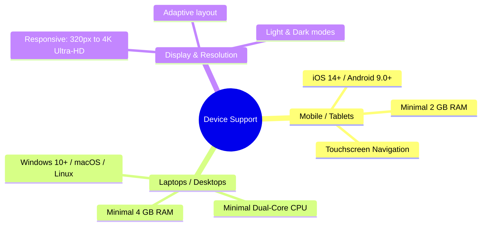

# Technical Requirements — SkillUp Platform

This document outlines the technical requirements needed to run, host, and access the **SkillUp** web platform on any device.

---

## 1. Client-Side (End-User Device) Requirements

Since **SkillUp** is built as a highly responsive single-page web application (SPA) using React, the system runs inside modern web browsers. It is optimized to perform smoothly on smartphones, tablets, laptops, and desktops.

### Browser Compatibility
To view and interact with the application, any device must run a modern, HTML5-compliant web browser with JavaScript enabled:

| Browser | Minimum Version | Recommended Version |
| :--- | :--- | :--- |
| **Google Chrome** | v90+ | Latest |
| **Apple Safari** (macOS, iOS, iPadOS) | v14+ | Latest |
| **Mozilla Firefox** | v85+ | Latest |
| **Microsoft Edge** | v90+ | Latest |
| **Brave / Opera / Vivaldi** | Any version from 2021+ | Latest |

### Device & Hardware Specifications



*   **Mobile Devices (iOS & Android):**
    *   **iOS / iPadOS:** iPhone 8 or newer, iPad 5th Gen or newer running iOS/iPadOS 14+.
    *   **Android:** Devices running Android 9.0 or newer.
    *   **Hardware:** Minimum 2 GB RAM; Dual-Core processor.
*   **Laptops & Desktop Computers:**
    *   **OS:** Windows 10/11, macOS Catalina or newer, or any modern Linux distribution (Ubuntu, Fedora, Debian, etc.).
    *   **Hardware:** Minimum Intel Core i3 / Apple M1 / AMD Ryzen 3, with 4 GB RAM (8 GB recommended for multitasking).
*   **Network:**
    *   An active Internet connection (3G, 4G, 5G, or Wi-Fi) with at least **1.5 Mbps** download/upload speed for smooth chart reloading and video recommendation playback.
*   **Display Resolution:**
    *   Fully responsive down to **320px** (mobile portrait) up to **3840px** (4K desktop monitors).

---

## 2. Server-Side (Host / Deployment) Requirements

If you want to host the SkillUp platform on a local computer, local server, or a cloud provider (such as Heroku, AWS, Vercel, or Render), the following host environment must be configured.

### Prerequisites

| Component | Required Version | Purpose |
| :--- | :--- | :--- |
| **Node.js** | `v18.x` or `v20.x` (LTS) | Runs the Express API server and Vite bundler |
| **npm** | `v9.x` or later | Manages project packages and dependencies |
| **MongoDB** | `v6.0` or later (or MongoDB Atlas) | Persistent database storage for user profiles and logs |

### Required Network Ports
The host system must have the following TCP ports open and unrestricted:
*   **Port `5173`**: Default port for the React / Vite frontend development server.
*   **Port `5000`**: Default port for the Express backend REST API server.

### Environment Configuration (`.env`)
The backend requires a configured `.env` file in the project root with the following parameters:
```env
PORT=5000
MONGO_URI=mongodb://localhost:27017/skillup  # Or your MongoDB Atlas connection string
JWT_SECRET=your_super_secure_jwt_secret_key
VITE_GOOGLE_CLIENT_ID=your_google_oauth_client_id.apps.googleusercontent.com
```

---

## 3. How to Run Locally (Quick Start)

To boot up the application on a development machine:

1.  **Start MongoDB:** Ensure your local MongoDB instance is running.
2.  **Install Dependencies:** Run the following command in the project root to install the clean, streamlined dependency tree:
    ```bash
    npm install
    ```
3.  **Seed Database (Optional):** Pre-populate mock users, courses, and schedules:
    ```bash
    node server/seed.js
    ```
4.  **Run Development Environment:** Start both the backend API server and frontend client concurrently:
    ```bash
    npm run dev:full
    ```
5.  **Access App:** Open `http://localhost:5173` on any computer or mobile browser connected to the local network.
